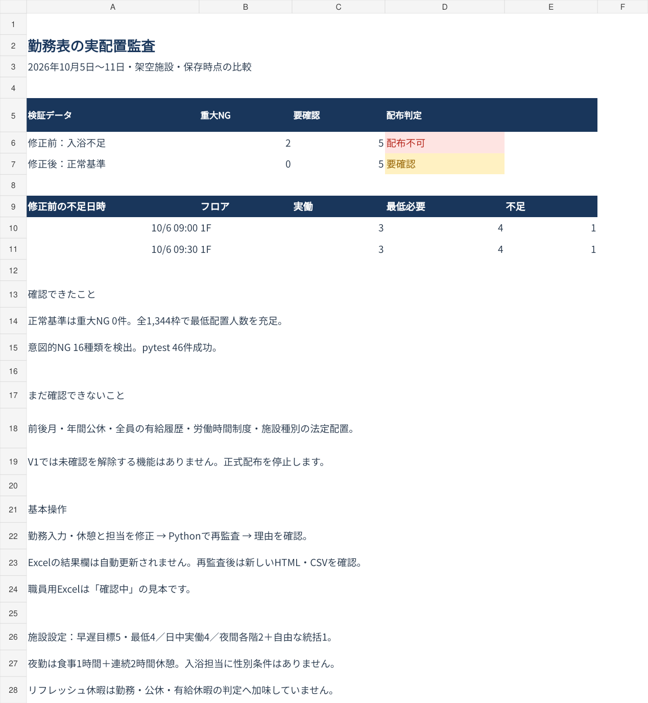
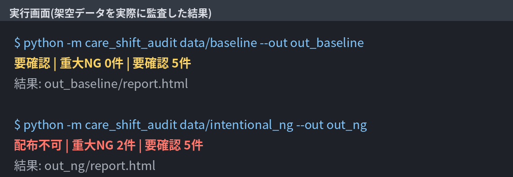
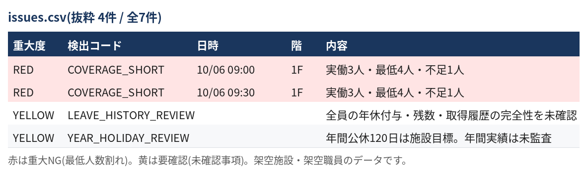
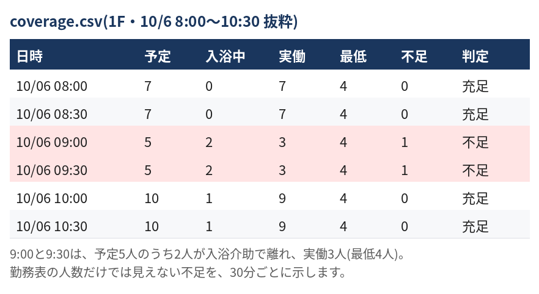
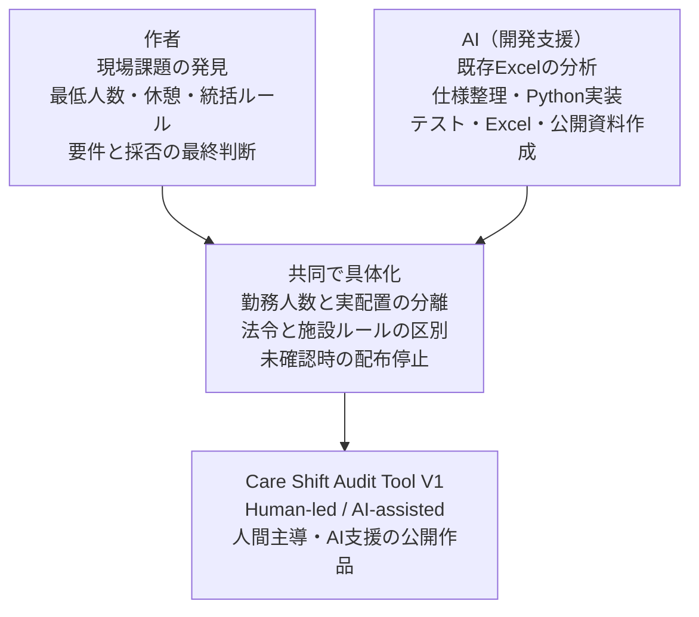

# Care Shift Audit Tool

**勤務表上の人数と、実際に現場にいる人数のずれを見つけるPython監査ツールです。**
休憩・入浴介助・他フロア応援を考慮し、30分ごとに「いつ・どこで・何人不足するか」を示します。

V1は架空施設向けのポートフォリオ・検証版です。正常基準は重大NG **0件**、要確認 **5件**。
制度や年間履歴を確認できないため、正式配布を止めます。実施設への導入完了を示すものではありません。

## Why I Built This

介護現場では勤務コード上の人数を満たしていても、休憩や入浴介助でフロアの人数が減ります。
作者はこの課題を題材に、現場の運用を言葉にし、法令と施設独自ルールを分け、AIと協働して検査可能な仕様へ整理しました。
「人が現場課題を発見し、仕様を決め、検証結果を見て改善する」過程も作品の一部です。

## Key Features

- 30分単位の実配置。休憩・入浴・離脱・応援の出入りを区別。
- 統括の二重計上防止。フロア担当中は自由な統括に数えない。
- 夜勤と短時間夜勤の日付またぎ、明け表示、勤務重複・勤務制限の監査。
- 法定休憩と施設独自休憩を別々に確認。中断した休憩を完了扱いしない。
- 残業可否・希望休・曜日・時間制限。残業は候補であり、配置人数へ自動加算しない。
- 月間時間枠や法定時間外集計、年休5日取得の一部確認。
- Excel/CSV入力、CSV/JSON/HTML出力。出力CSVの見出しは日本語表記(2026-09-27対応)。AI接続・APIキー不要。

## Screenshot



同じ基準例に入浴介助の時間帯だけを変更すると、10月6日09:00と09:30の1Fで1人不足します。
この2枠を直すと重大NGは0件になりますが、残る未確認を消して緑に見せることはしません。

## How It Works

1. 入力：`勤務入力`と`休憩と担当`、またはCSVを編集する。
2. 監査：Pythonを実行する。
3. 確認：生成された`report.html`で理由を確認し、`coverage.csv`で配置を見る。
4. 修正・再監査：入力を直して再実行する。
5. 配布：V1の未確認事項が残る間は正式出力を停止する。

**納品Excelの監査結果は保存時のスナップショットです。Excelを編集しただけではPython監査も結果欄の更新も行われません。**
再監査は新しいHTML・CSVへ出力します。Excelの不足人数の列には確認用数式がありますが、入力全体を再監査する代わりにはなりません。

## 出力例(実行の流れ)

付属の架空データ(`data/baseline`と、入浴介助の時間帯を変えた`data/intentional_ng`)を実際に監査した結果です。
画像は、PC画面の撮影ではなく、出力された結果から作成しています(CSVは一部の行の抜粋)。

**1. 実行する。** 結果の判定と件数が1行で表示されます。



**2. 指摘の一覧を見る。** 赤は重大NG(最低人数割れ)、黄は要確認です。



**3. 30分ごとの人数で理由を確かめる。** 勤務表上は予定5人でも、2人が入浴介助で離れるため、実働は3人(最低4人)になります。



## Test Strategy

`python -m pytest -q`で正常例・意図的異常・境界条件・配布停止を検査します。
実行結果は[テスト結果](docs/TEST_REPORT.md)を参照してください。

正常基準：7日×48枠×4区分（3フロアと統括）=1,344枠、人数不足0枠・重大NG0件。
異常：16種類を基準例から別々に作り、期待する検出コードを確認。
休憩の6時間・8時間境界、残業の上限境界、年休の適用対象、入力順序、重複・欠損・端数時刻も検査します。
この結果は用意したデータについての検証であり、すべての入力や法令の無欠陥を保証するものではありません。

正常基準と同じ72人＋架空職員（合計122人）で、監査期間を2026年10月の1か月分（31日×48枠×4区分=5,952枠）に広げた例も用意しています（`data/one_month_example/`）。
結果は正常基準と同じく人数不足0枠・重大NG0件です。ただし、この例の配置は月間の残業上限・夜勤回数上限に近づくところまでは作り込んでおらず、月単位のチェックが実際に働く様子を見せるものではありません。月をまたぐ規模でも監査ロジックが崩れないことの確認が主な目的です。

原本の72人だけを使い、人が足りない枠が出ても増員しない例（`data/understaffed_2026_10`〜`understaffed_2027_03`）も用意しています。2026年10月〜2027年3月の6か月間、施設ルールを守ったまま72人だけで配置を続けると、実際にどれだけ手薄になるかを検証したものです（詳細は[テスト結果](docs/TEST_REPORT.md)）。増員するか休日出勤で埋めるかの判断は、この重大NG・要確認の表示そのものが管理者への材料になるという位置づけで、ツール側で解決策を提案する機能は作っていません。

## Configuration Beyond Defaults

「統括」という役割名・「統」という勤務コード、「休・明・有」の3コード、「早」「遅」の勤務コード、週の起算曜日は、config.jsonの`supervisor_role`・`supervisor_shift_code`・`off_code`・`post_night_code`・`paid_leave_code`・`early_shift_code`・`late_shift_code`・`week_start_weekday`で施設ごとに変更できます。未指定の場合は元の値のまま動作し、既存データの判定結果は変わりません。早番・遅番のコードを変えたのに`early_shift_code`・`late_shift_code`を指定し忘れた場合は、大量の「人数不足」ではなく、原因が分かる入力エラー(配布不可)として表示します。

## Human / AI Collaboration

**Human-led / AI-assisted development（人間主導・AI支援開発）**。
現場課題の抽出、運用ルール、要件の最終判断は作者が行い、AIは要件整理・実装・レビュー・テスト・資料作成を支援しました。
今回追加した細部の設計案は[CONTRIBUTIONS.md](CONTRIBUTIONS.md)に区別しています。作者が全コードを単独で書いたとは表現しません。



## Legal vs Facility Rules

法定休憩、年休、36協定等と、早遅4人・夜間2人・連続休憩2時間・年間公休120日等の施設条件を区別しています。
2026年9月13日に参照できる厚生労働省の一次資料を照合しました。
根拠・導入手続・計算範囲は[法令確認](docs/LEGAL.md)、一覧は[ルール表](docs/legal-rules.json)に記載。

## Tech Stack

Python 3.10以上、標準ライブラリ、openpyxl（Excel読み取り）、pytest、GitHub Actions。
納品Excelと画像の作成はAI作業環境の表計算機能を使用。Python本体の実行に同機能やNode.jsは不要です。

## How to Run

ZIPを展開し、`pyproject.toml`があるフォルダで実行します。Windowsでは次の順です。

```powershell
py -m pip install -r requirements.txt
py -m pip install -e .
py -m care_shift_audit data/baseline --out reports/current
```

生成された`reports/current/report.html`をダブルクリックして開きます。
Excelから再監査する場合：

```powershell
py -m care_shift_audit examples/Care_Shift_Audit_V1_Manager.xlsx --out reports/from_excel
```

意図的NG、既存Excelからの移行データ、テスト：

```powershell
py -m care_shift_audit data/intentional_ng --out reports/ng
py -m care_shift_audit data/legacy_import --out reports/legacy
py -m care_shift_audit data/one_month_example --out reports/one_month
py -m care_shift_audit data/understaffed_2026_10 --out reports/understaffed_2026_10
py -m pytest -q
```

CSV入力だけならPython標準ライブラリで動作します（`PYTHONPATH=src`の指定が必要）。
初回インストールにはインターネット接続が必要です。確認した環境はLinux/Python 3.12.14。
Windows＋Microsoft Excelでの実機確認は未実施です。

## Project Structure

```text
src/care_shift_audit/   入力・監査・出力を分離したPython
tests/                 正常系・異常系・境界・配布停止
data/baseline/         正常基準のCSVと設定（7日間）
data/one_month_example/ 同じ設定を2026年10月の1か月分に広げた例
data/understaffed_*/   72人だけ・増員なしで6か月分を組んだ、手薄をそのまま見せる例
data/intentional_ng/   入浴による不足を含む比較例
data/legacy_import/    既存Excelから移した入力
data/legacy/           元Excel2点と移行用抽出データ（未変更）
examples/              管理者Excel・職員用未確定見本
reports/               再現可能な保存時監査結果
docs/                  根拠・制約・テスト・開発過程
.github/workflows/     push / pull request時のテスト設定
```

## Limitations

- **V1は正式配布に進めません。** 5つの未確認カテゴリを常時残します。緑への手動変更や承認上書きはありません。
- 年間公休、完全な年休台帳、前後月、制度の適法な導入、施設種別の法定配置基準は未対応。
- 1か月変形制の日・週・期間の法定時間外をシフトから完全計算しません。月間総枠の警告と、別途確認済み集計値の上限検査です。
- 月間総枠超過は、直ちに違法と断定せず、計画枠・協定・法定時間外の要審査として配布を止めます。
- 30分境界の入力のみ。15分単位等は拒否し、丸めて人数充足にしません。
- 明けは、短Aのように日付をまたぐ短時間勤務も対象。翌日を一律公休にしないための施設ルールです。
- 残業候補は指定した職員の可否確認まで。候補者の自動探索、次勤務・深夜割増・協定別上限との総合審査は未実装。
- 早番・遅番の目標人数(`early_target`・`late_target`)に届かない日・フロアは、重大NGではなく要確認の警告として出ます(最低人数を割った場合は従来どおり重大NGだけ)。日中・夜勤にも、任意の目標人数(`day_target`・`night_target`)を設定できます。最低人数は満たすが目標に届かない日(夜勤は夜間)・フロアを、要確認(`DAY_BELOW_TARGET`・`NIGHT_BELOW_TARGET`)として1期間につき1件出します(30分ごとの最少の実働人数を表示)。その期間に最低人数割れがあれば重大NGのみで、警告は重ねません。夜間は開始日でまとめるため、勤務表の最初の夜間は前日付けの1件になります。設定しなければ出ず、設定するなら0以上の整数で最低人数以上です。
- 一部マスタは共通設定です。フロア別最低人数や曜日別必要人数の個別マスタは将来対応。
- 納品Excelの再生成はPython CLIでは行いません。更新された結果は汎用CSVとHTMLで受け取ります。

## Future Improvements

優先順は、①実際のWindows/Excelでの利用確認、②制度・年間履歴と承認の証跡管理、③Pythonから管理者Excelを継続更新する出力経路、④フロア別・曜日別条件。
その後、月間勤務表・年間公休・有給管理、自動シフト作成、給与計算、人件費、Web化、外部システム連携を検討します。

## Interview

「介護現場では、勤務表の人数が足りていても、休憩や入浴介助で現場の人数が減ります。
そこで現場ルールを整理し、30分ごとの実働人数を確認するPythonツールを、AIの支援を使って作りました。
異常の検出と正常例の誤検知を両方テストし、情報不足があれば正式配布を止める設計にしています。」

強く説明する3点は、**現場課題を仕様にしたこと／正常と異常の両方で試したこと／判定できない範囲を明示したこと**です。
